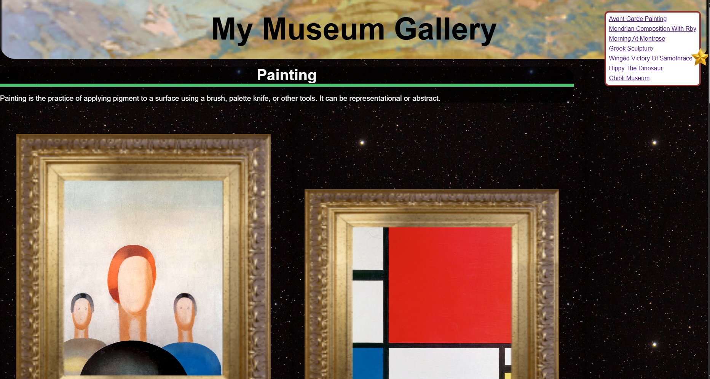

# 🎨 My Gallery Art

A minimalist and responsive web-based art gallery built with HTML, CSS, and JavaScript. This project showcases artworks in a clean, modern layout with interactive features like smooth scrolling and animated effects.

## 🌟 Features

- **Responsive Layout**: Adapts seamlessly to various screen sizes for optimal viewing on desktops, tablets, and mobile devices.
- **Interactive Animations**: Elements shake upon navigation to draw user attention.
- **Sticky Headers**: Section headers remain visible while scrolling through content.
- **Image Scaling**: Images adjust to fit their containers while maintaining aspect ratios.
- **Color Text**: Applies color effects to text elements for enhanced visual appeal.
- **Semantic HTML**: Utilizes semantic elements like `<main>` and `<section>` for improved accessibility and SEO.

## 📁 Project Structure

```txt
My-Gallery-Art/
├── index.html          # Main HTML file
├── styles.css          # Styling for the gallery
├── script.js           # JavaScript for interactivity
├── images/             # Folder containing artwork images
├── .vscode/            # VS Code settings (optional)
├── .gitignore          # Git ignore file
├── .prettierignore     # Prettier ignore file
├── .prettierrc         # Prettier configuration
└── LICENSE             # MIT License
```

## 🚀 Getting Started

To view the gallery locally:

1. **Clone the repository**:

   ```bash
   git clone https://github.com/SadNguyen2107/My-Gallery-Art.git
   ```

2. **Navigate to the project directory**:

   ```bash
   cd My-Gallery-Art
   ```

3. **Open `index.html` in your preferred web browser**.

No additional setup or dependencies are required.

## 🖼️ Preview



*Replace `preview.png` with an actual screenshot of your gallery placed inside the `images/` directory.*

## 🛠️ Customization

- **Adding Artworks**: Place your artwork images in the `images/` folder and reference them in `index.html`.
- **Styling**: Modify `styles.css` to change colors, fonts, layouts, and other stylistic elements.
- **Interactivity**: Enhance or alter animations and behaviors by editing `script.js`.

## 📄 License

This project is licensed under the [MIT License](LICENSE). Feel free to use and modify it for your own projects.
